# Open Sesame with Twilio Studio and Sync

Communication between the world of humans and the world of machines does not need to be apocalyptically hard or prohibitively expensive every time. In this project, we are going to use Twilio to build a voice call operated garage door opener. We will also try to be prompt, and avoid writing massive amounts of code. Instead, in order to stitch all the parts together, we will use a visual workflow and a device registry.

Building the Dispatch Center
First things first, we are going to need a Twilio account. Trial account will do just fine, [follow this link](https://www.twilio.com/try-twilio) to create one it if you haven’t done it already.
We are going to use the following Twilio services. Some of them are currently in the developer preview phase, so an extra on-boarding step is required.

1. [Phone Numbers](https://www.twilio.com/phone-numbers): provides you with a local phone number to call or text.

2. Studio: is a drag-and-drop visual builder for Twilio. Request early access by [submitting this application](https://www.twilio.com/studio).

3. [Sync](https://www.twilio.com/sync): is a purpose built API for state synchronization.

4. Sync for IoT: lets you provision and authenticate devices. Request early access by [submitting this application](https://www.twilio.com/sync/iot).

## Setting Up the Flow

As a first step, let’s sketch out our application logic by creating a new flow. Navigate to [Studio Dashboard](https://www.twilio.com/console/studio/) and click "Create New Flow" button. Give it a friendly name, e.g. "Open Sesame".

The flow starts with the _Trigger_ widget, which is already there. We will attach a number of widgets to program the behavior of our voice controlled garage door. At a high level, we would like to play out a greeting message, then collect caller’s input and validate it. If caller is recognized, we will store the opening instruction, and finally confirm success with another message before hanging up.

When we are done building, our flow should look like something like this. So let’s start rocking!

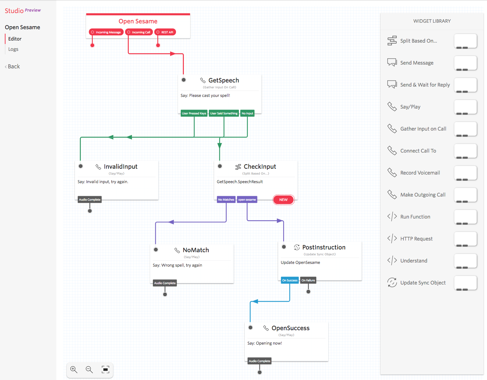

### Speech Processing
Locate the "Gather Input on Call" block in the widget library and drag it into the flow. Connect it to "Incoming Call" pin of our Open Sesame widget above so that it gets executed whenever someone calls a Twilio voice number.

Let’s call it **"GetSpeech"**, and configure with the following parameters:

- Widget name: type **"GetSpeech"**.
- Say or play message: select "Say a Message".
- Text to say: type "Please cast your spell!".
- Leave the rest as default.
- Click "Save" button.

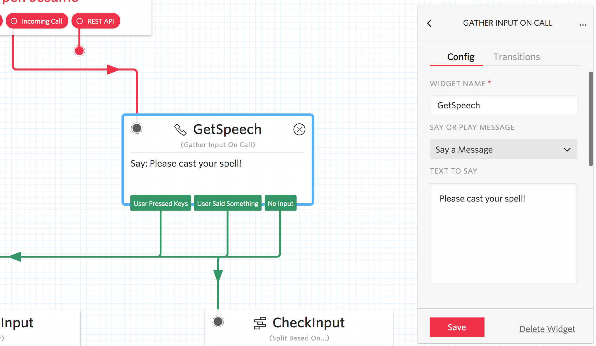

But what if the caller did not say anything reasonable? Let’s gracefully report an error and hang up. Locate the "Say/Play" block in the widget library and drag it into the flow, connecting to "User Pressed Keys" and "No Input" pins of the *"GetSpeech"* widget we created earlier.

Let’s call it "InvalidInput", and configure with the following parameters:

- Widget name: type **"InvalidInput"**.
- Say or play message: select "Say a Message".
- Text to say: type "Invalid input, try again."
- Click "Save" button.

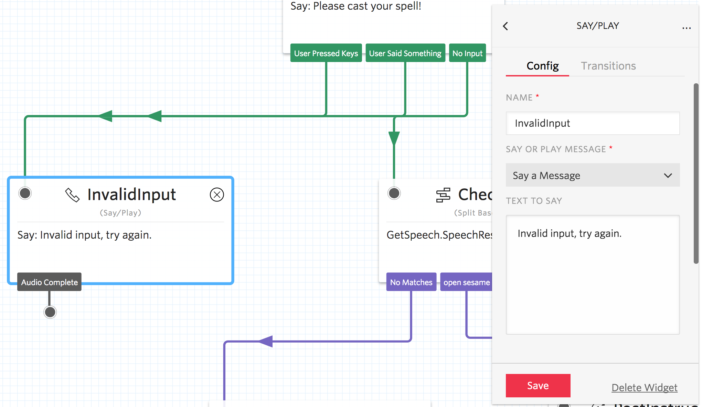

### Input Validation

Following the voice input, we would like to validate it for correctness, before letting the caller to open our garage. For a more robust solution, you might want to switch to DTMF based PIN code instead, but in this tutorial we are doing speech-to-text validation just for fun.

Locate the "Split Based On…" block in the widget library and drag it into the flow. Connect it to "User Said Something" pin of the *"GetSpeech"* widget we created earlier.

Let’s call it **"CheckInput"**, and configure with the following parameters.

- Widget name: type "CheckInput".
- Variable to test: select "GetSpeech.SpeechResult".
- Transitions tab: click "New Transition", select "Equal To".
- New transition value field: type "Open sesame".
- Click "Save" button.

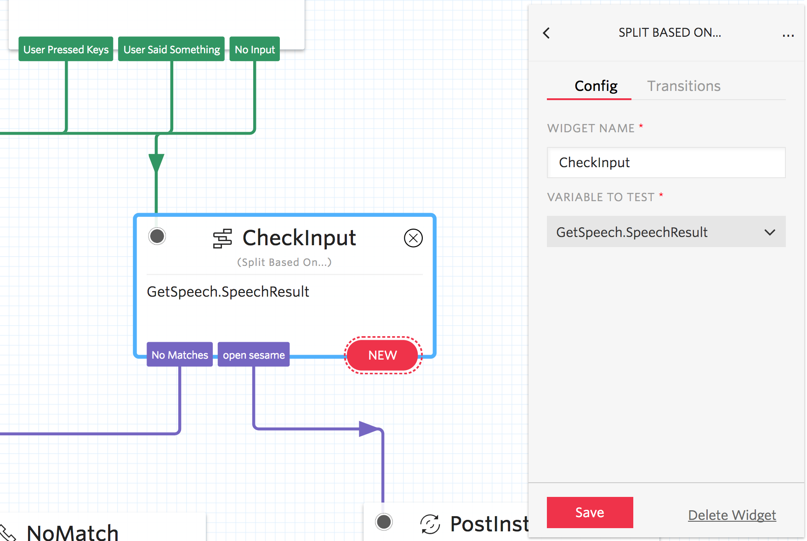

In case the caller forgot how to cast the right spell, we will want to fail gracefully and play out a relevant voice message.  Locate the "Say/Play" block in the widget library and drag it into the flow, connecting to the "No Matches" pin of the *"CheckInput"* widget we created earlier.

Let’s call it **"NoMatch"**, and configure with the following parameters:

- Widget name: type "NoMatch".
- Say or play message: select "Say a Message".
- Text to say: type "Wrong spell, try again."
- Click "Save" button.

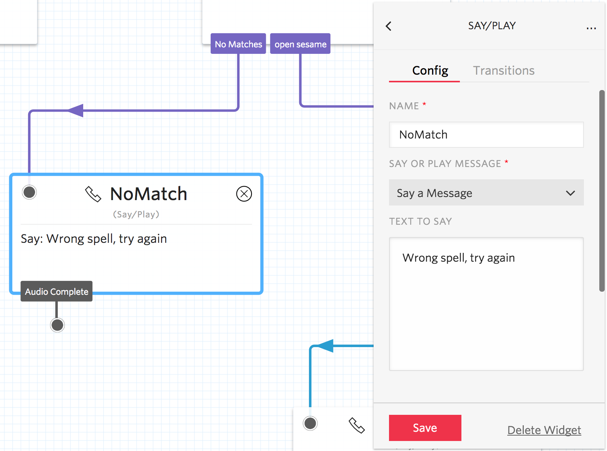

### Deliver Instruction

At this point, we would like to dispatch an opening instruction to our garage door actuator. Locate the "Update Sync Object" block in the widget library and drag it into the flow. Connect it to "open sesame" pin of the *"CheckInput"* widget we created earlier.

Let’s call it **"PostInstruction"** and configure with the following parameters.

- Widget name: type "PostInstruction".
- Sync service SID: leave as "default".
- Object type: select "List".
- Object SID or unique name: type "OpenSesame".
- Value: copy & paste the following JSON string {"caller":"studio"}.
- Click "Save" button.

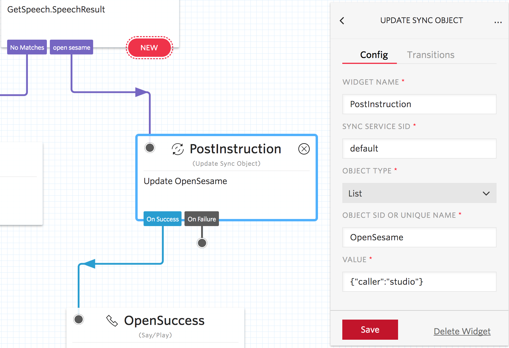

Finally, we are going to say some nice words back to the caller. Locate the "Say/Play" block in the widget library and drag it into the flow, connecting to the "On Success" pin of the *"OpenSesame"* widget we created earlier.

Let’s call it **"OpenSuccess"**, and configure with the following parameters:

- Widget name: type "OpenSuccess".
- Say or play message: select "Say a Message".
- Text to say: type "Opening now!".
- Click "Save" button.

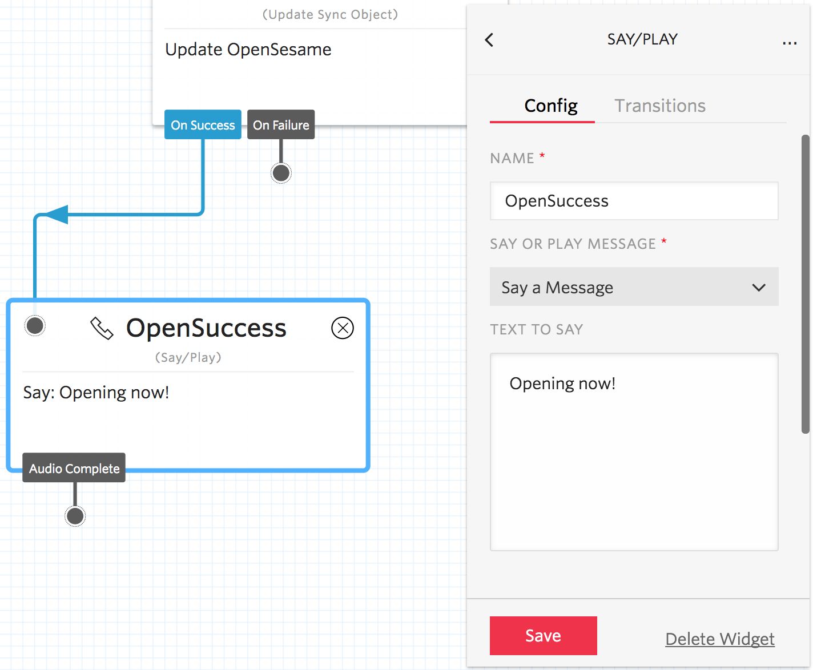

## Linking a Phone Number

In order to get our wonderful flow running, we need to hook it up to a voice phone number and react to an incoming call. Let’s start by creating a new number under the [Phone Numbers dashboard](https://www.twilio.com/console/phone-numbers/incoming).

- Click "Buy a Number" button.
- Select your country from the list.
- Check "Voice" from capabilities filter.
- Click "Search" and pick the number you like best by clicking "Buy".
- After you get the new number purchased, click the "Setup number" button to configure incoming call behavior.
- Under the "Voice & Fax" section, locate the "A call comes in" field, and switch it to "Studio Flow".
- Select "Open Sesame" from the flow list.
- Click "Save" button.

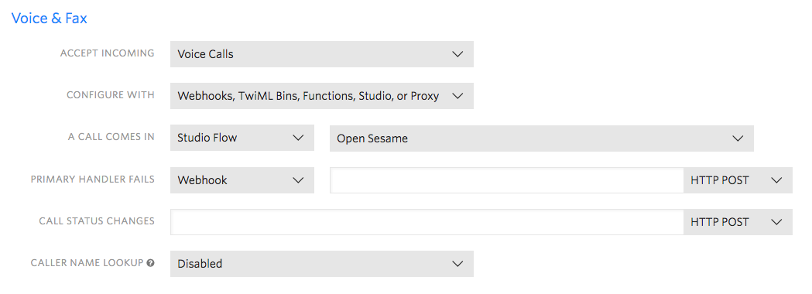

## Testing the Flow

At this point we could already trigger the workflow to see how it works.

1. First, create a new Sync List object called "OpenSesame" that the workflow starts populating. To do so, navigate to [API Explorer (Create a Sync List)](https://www.twilio.com/console/runtime/api-explorer/sync/sync-lists/create) and supply the following parameters:

  - Service SID: type "default"
  - Unique name: type "OpenSesame"
  - Click "Make Request"

  Alternatively, if you prefer using command line, use the following cURL snippet to create the List.

        curl https://sync.twilio.com/v1/Services/default/Lists -X POST \
          --data-urlencode 'UniqueName=OpenSesame' \
          -u ACxxxxxxxxxxxxxxxxxxxxxxxxxxxxxxxx:[AuthToken]

2. Next, using your phone, call the Twilio number you purchased above and talk to Alice, our senior garage door opener assistant.

3. Finally, check our Sync List for newly added items with opening instructions. To do so, navigate to [API Explorer (View Sync List Items List)](https://www.twilio.com/console/runtime/api-explorer/sync/sync-lists/sync-list-items-read) and supply the following parameters:

  - Service SID: type "default"
  - List SID: type "OpenSesame"
  - Click "Make Request"

In the "Response" panel you should see at least one item in the array, assuming your discussion with Alice was positive.

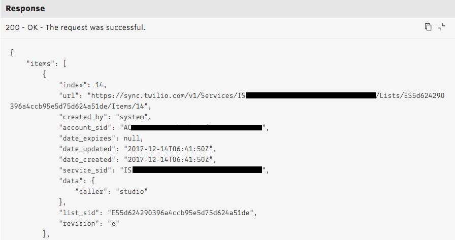

Alternatively, if you prefer using command line, use the following cURL snippet to query the List items.

    curl https://sync.twilio.com/v1/Services/default/Lists/OpenSesame/Items \
      -u ACxxxxxxxxxxxxxxxxxxxxxxxxxxxxxxxx:[AuthToken]

## Building the Door Actuator

Let’s now move over to the hardware part of our little project. To keep things clean, simple and low-cost, we’re going to use [Grove](http://wiki.seeed.cc/Grove_System/) prototyping system, and an IoT development board powered by a popular Wi-Fi enabled [ESP8266](https://en.wikipedia.org/wiki/ESP8266) SoC. The door actuator aside, we expect such setup to cost less than $10.

### Assembling the Hardware

With this particular kit, the assembly is going to be quite straightforward. We are going to need the following items:

- One [Sonoff DEV](https://www.itead.cc/wiki/Sonoff_DEV) or [Wio Link](http://wiki.seeed.cc/Wio_Link/) board.
- One [Grove Relay](http://wiki.seeed.cc/Grove-Relay/).
- A door actuator unit, which you might have already.

Alternatively, if you are good at soldering stuff, feel free to grab any ESP8266 kit and attach a relay to it that can handle 240VAC.

We are going to assume that the door actuator supports a hard-wired "button" input, which most of commercial and industrial garage opener units do.

- Follow the basic safety rules, and power down the actuator first. Consult your door opener installation manual, to ensure it has a normally open button/switch input. Ensure input voltage and current ratings are compatible with your relay.
- Connect the Grove relay board to Sonoff DEV top-left port (J5) or Wio Link bottom-right port (J8). Both of them should have GPIO4 and GPIO5 pins.
- Then wire up the normally-open input of the door actuator to Grove relay board terminals.

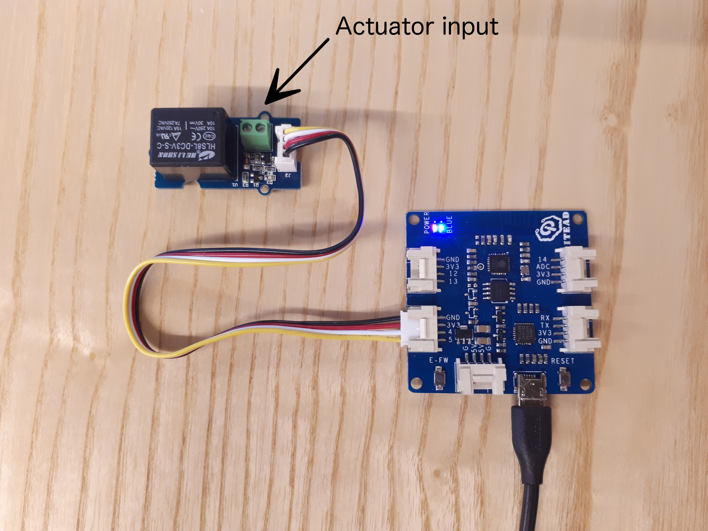

### Registering the Device

Up until this point, we didn’t know how to identify and trust the new device in your application. Let’s fix that by creating its unique identity and an authentication key.

Navigate to [Sync for IoT console](https://www.twilio.com/console/devices) and click on "Visit the Device Manager". We have an empty fleet automatically provisioned for you, called "Default Fleet".

- Under the [default fleet](https://www.twilio.com/console/devices/fleets/default/devices), click "Create a Device" button.
- Provide a friendly name, e.g. "Garage door actuator" and make sure "Enabled" is checked.
- Click "Create" to finish.

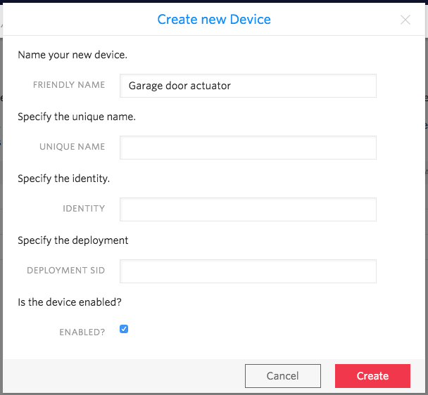

Now that we have a device identity, let’s add a device access key for it to authenticate with the backend.

- Under the "Garage door actuator" menu, pick "Keys" section and click "Create a Key".
- Call it e.g. "Door actuator key" in the friendly name field.
- Leave the device SID unchanged.
- Click "Create".

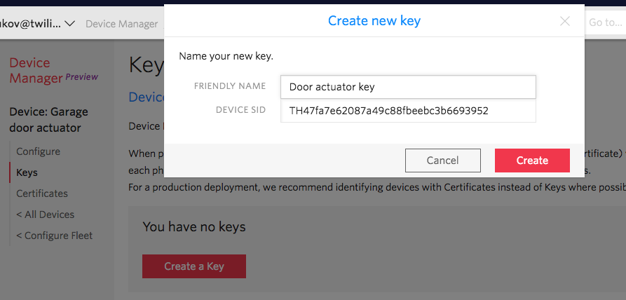

Keep the contents of "Key SID" and "Secret" fields around, we’ll need those in a moment.

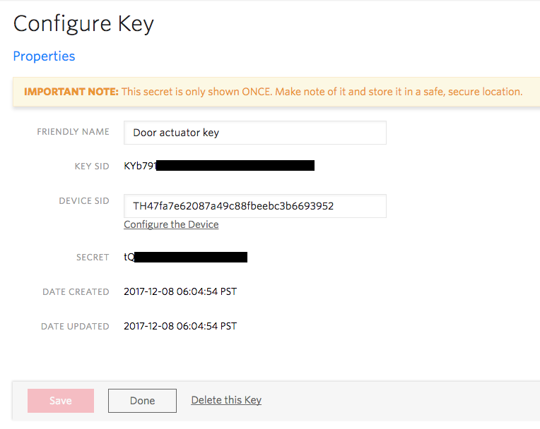

### Flashing the Firmware

Finally, let’s prepare the firmware that goes into ESP8266 microcontroller and gets the garage door opener online. We are going to use the following open-source components to build it.

- Arduino core for ESP8266 (by Arduino team, [GitHub](https://github.com/esp8266/Arduino))
- PubSubClient MQTT client (by Nick O’Leary, [GitHub](https://github.com/knolleary/pubsubclient))
- ArduinoJson (by Benoit Blanchon, [GitHub](https://github.com/bblanchon/ArduinoJson))

Most importantly, clone the garage door opener project code from [our GitHub](https://github.com/dr0nius/twilio-open-sesame). Then:

- Open it in Arduino Desktop IDE, or follow these [instructions](https://www.arduino.cc/en/Guide/HomePage) if you don’t have it installed.
- Install the ESP8266 board support package using the Arduino IDE Tools -> Boards Manager, following these [instructions](https://github.com/esp8266/Arduino#installing-with-boards-manager).
- Install PubSubClient and ArduinoJson libraries using the Sketch -> Include Library -> Library Manager, following these [instructions](https://www.arduino.cc/en/Guide/Libraries).

Next, you will need to make some changes to the C++ sketch in order to get it working with your network and device setup.

Start by configuring your WiFi network/key. Replace "YOUR_WIFI_SSID" and "YOUR_WIFI_PASSWORD" values in the Arduino code to match your network setup.

Then, copy & paste your device key SID and secret from the "Registering the Device" step above, replacing the "YOUR_DEVICE_KEY" and "YOUR_DEVICE_SECRET" values in the source code.

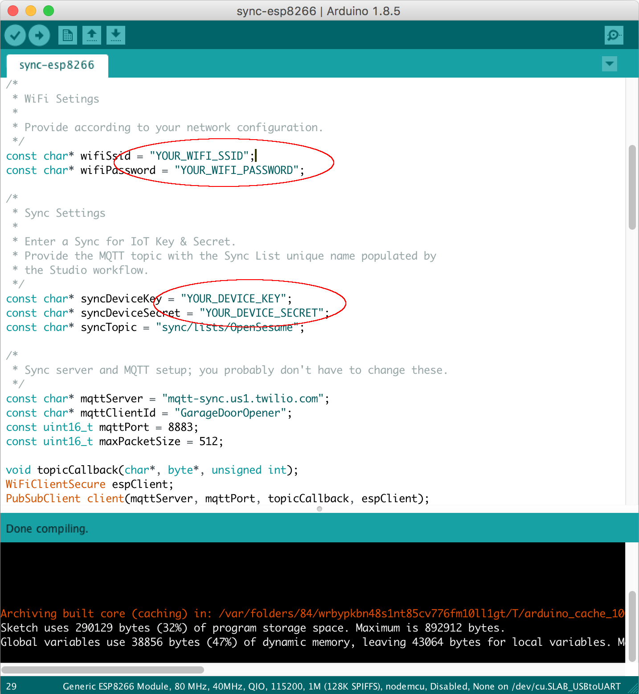

Finally, select the right board in Arduino IDE and compile the sketch. For the boards mentioned above, the following settings will work:

- Board: Generic ESP8266 Module
- Flash mode: QIO
- Flash size: 1M (128K SPIFFS)
- Reset method: nodemcu
- Port: pick the newly added USB serial port (OS specific)

Connect your ESP8266 board via USB and upload the resulting binary. We should be all set for the final test: open the Arduino serial monitor (Tools -> Serial Monitor), reset the board and observe the output. Assuming everything went well, you should receive the following log of messages and hear the relay click when the Studio workflow executes:

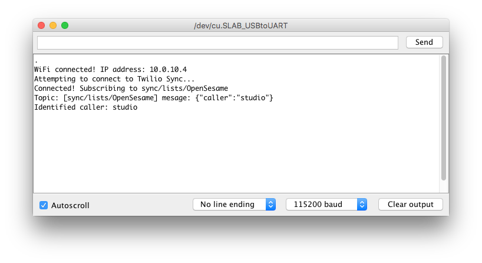

## Connecting Humans to Machines with Twilio

What we have achieved here closes the gap between the Contact Center use-cases and IoT Machine-to-Machine use-cases, with Twilio Sync building a bridge between the two. Flows initiated by humans get propagated through the system in real-time and trigger machines to perform mission critical tasks.

After making the above basics happen, you could further grow this project and apply the Twilio services and tools to support more scenarios.

- Add PIN authorization via DTMF  and make the voice responder more secure.
- Make the contact center multi-tenant and personalized, extending the workflow to invoke more logic, using [Twilio Functions](https://www.twilio.com/docs/api/runtime/functions).
- Extend the fleet of connected devices, adding more door actuators, locks, and other remotely controlled smart-building objects..
- Provide continuous feedback from connected sensors and build a real-time dashboard, rendering a live view of all your doors, elevators, etc.

We can’t wait to see what you build next!
